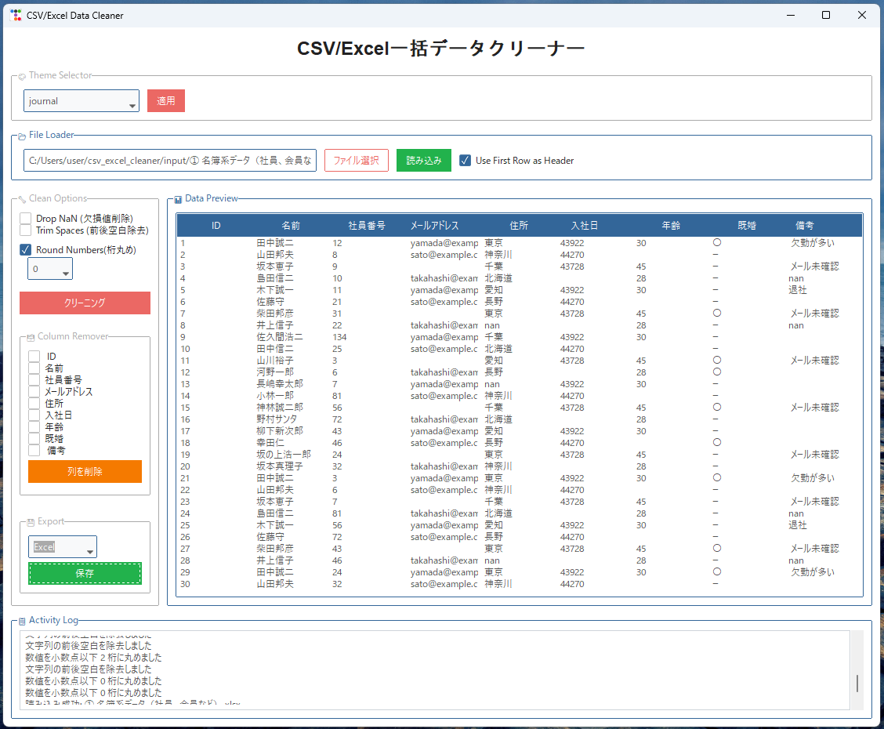
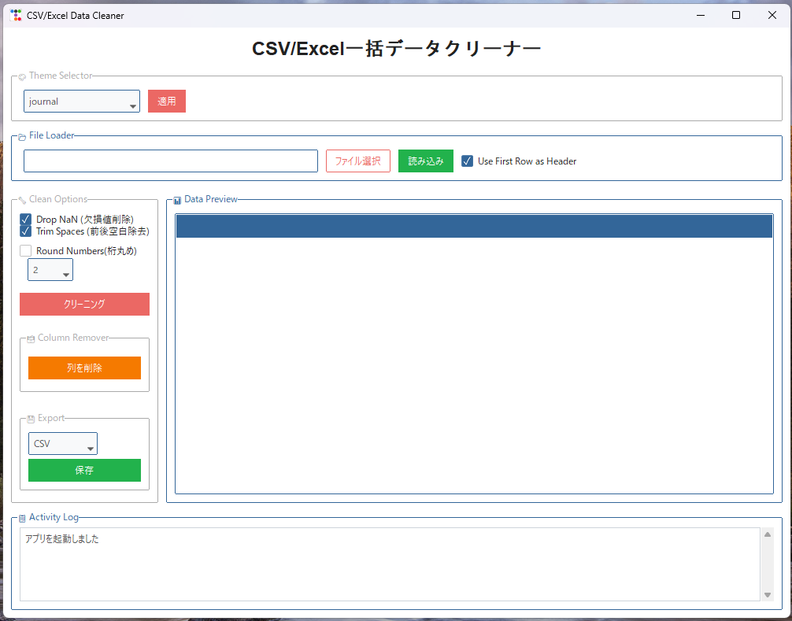
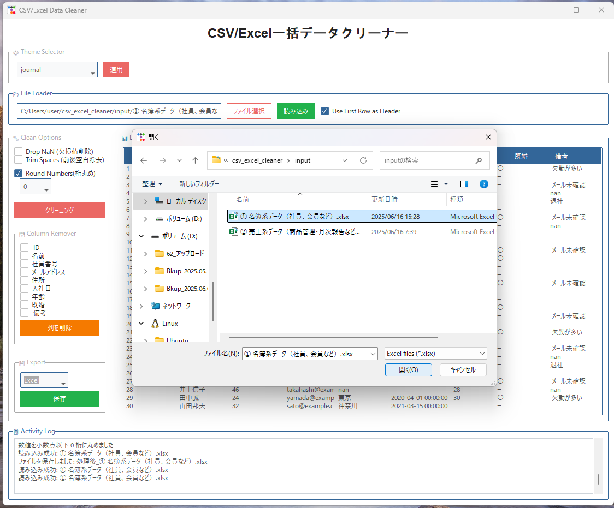
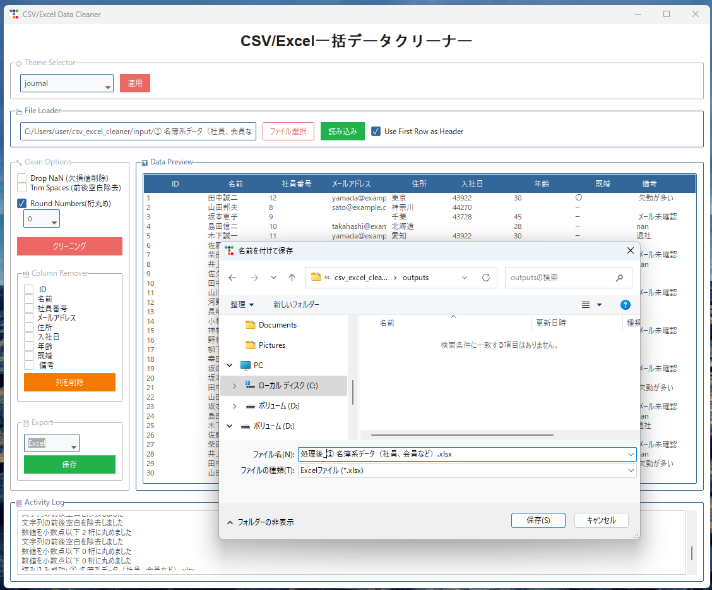
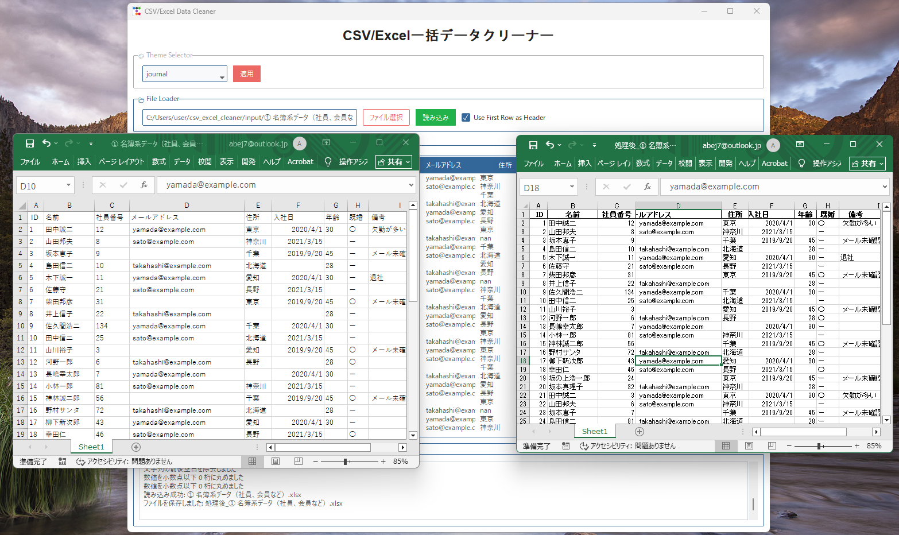

# CSV/Excel 一括データクリーナー

日本語対応のスタイリッシュなデータクリーニングツールです。CSVやExcelファイルを読み込んで、欠損値削除・前後空白除去・数値の桁丸め・不要な列の削除・形式別保存などをGUI操作で簡単に行えます。

---

## 🧰 主な機能

- CSV または Excel (.xlsx) ファイルを読み込み
- 欠損値（NaN）行の一括削除
- 文字列の前後の空白（Trim）の一括除去
- 数値データの小数点以下桁丸め（指定可）
- 列の個別削除（チェック方式）
- CSV または Excel形式で保存
- Bootstrap風テーマ切り替え機能
- 処理ログのスクロール表示

---

## 🖥 動作環境

- Python 3.10 以上推奨
- OS: Windows 10/11

---

## 📦 使用ライブラリ

- `pandas`
- `openpyxl`
- `ttkbootstrap`

インストール：
```bash
pip install pandas openpyxl ttkbootstrap
```

---

## 🚀 実行方法

```bash
python csv_excel_cleaner_app.py
```

---

## 🖼 画面イメージ
### 1. 初期画面

### 2. データ取り込み（EXCEL又はCSV）

### 3. 作業イメージ

### 4. データ出力（EXCEL又はCSV）

### 5. 入出力イメージ


---

## 📁 ファイル構成例

```
├── app/
│   └── csv_excel_cleaner_app.py
├── input/
│   └── サンプルデータ.xlsx
├── README.md
```

---

## 📌 補足

- UIは`ttkbootstrap`を使用しており、テーマ選択機能により見た目の印象を変更可能です。
- 読み込んだデータはリアルタイムで表示・編集できます。
- このツールは `pandas` を使用しているため、**列単位や行単位の処理を自由にカスタマイズ**できます。
  - 例：特定列の値の変換、行ごとの条件分岐、集計列の追加など
  - GUIや処理ロジックを拡張してポートフォリオや業務用ツールにも応用可能です。

---

## 👨‍💻 作者

- GitHub: [abej7](https://github.com/abej7)
